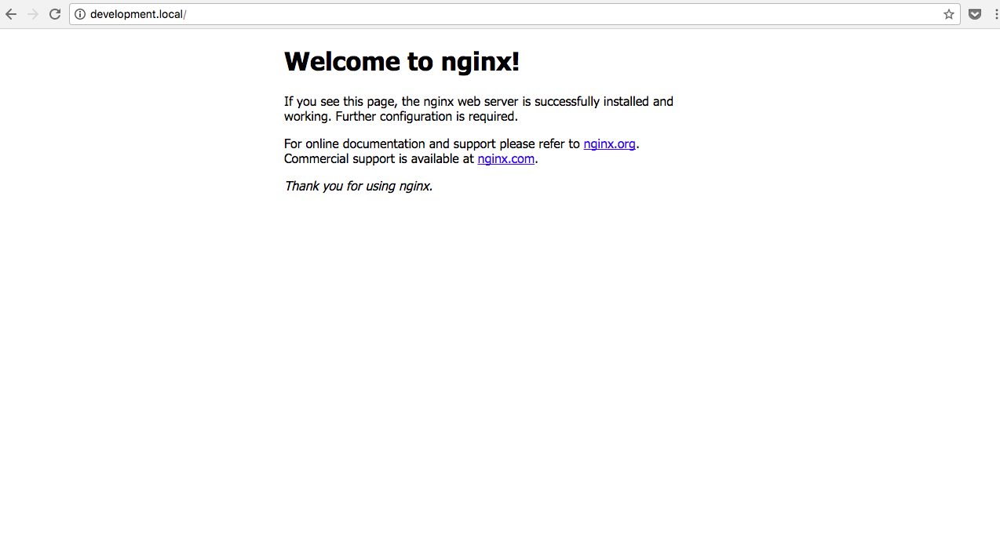

# How to run your Virtual Machine

## Downloads 

### Download and install Virtual Box and Vagrant :

* [Virtual Box](https://www.virtualbox.org/wiki/Downloads)

* [Vagrant](https://www.vagrantup.com/downloads.html)

## Execute the following :

1. Clone the directory using git:

 `git clone git@github.com:ghariosk/DevOps.git`

2.  Enter the directory :

 `cd DevOps`

3. Run  `vagrant up` in the terminal.

4.  Then run  `vagrant ssh`.

5.  Then enter this in your browser: 

   		http//:development.local

You should be directed to the nginx home page:

